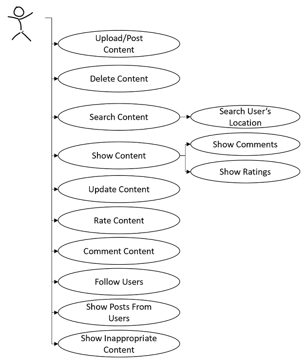
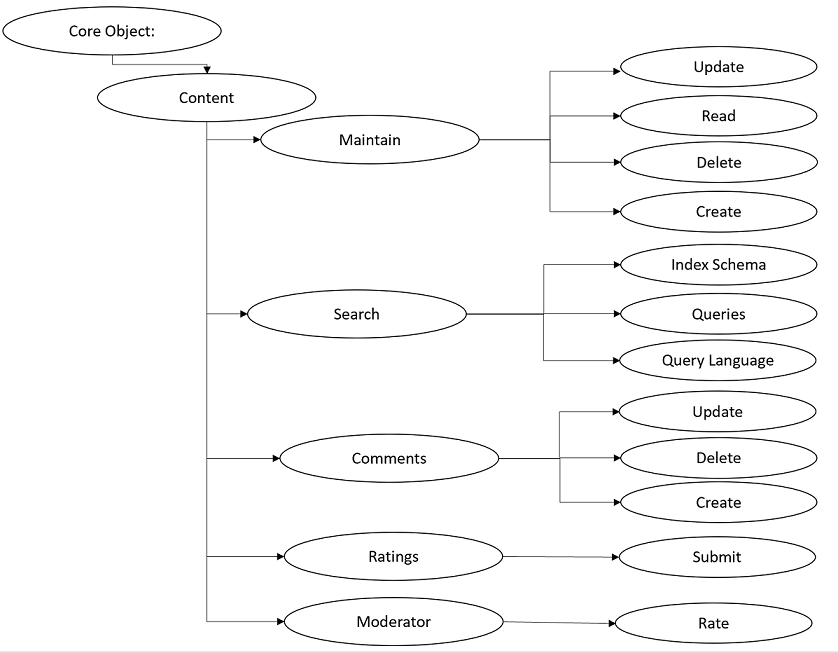
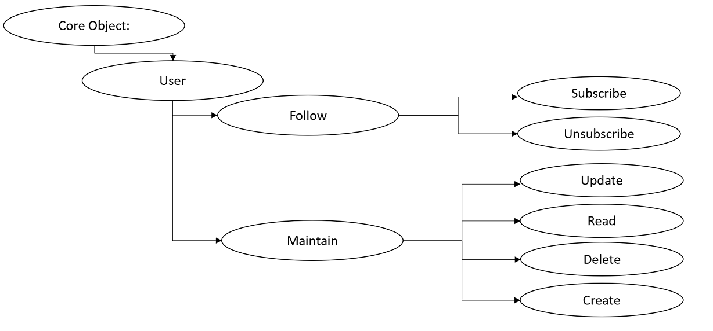
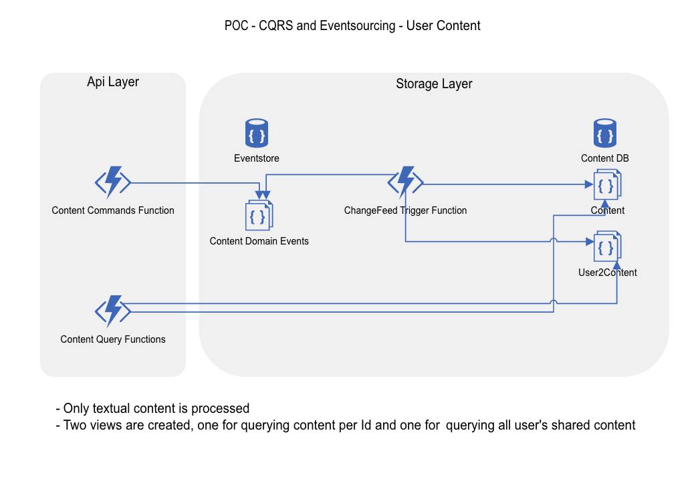

## Goal:
- The goal is to develop a social platform that allows users to upload pictures and videos and share them with the people around them.
 
### Functional requirements:
- The user can register in the system via email or password
- The user must confirm his account by clicking the activation link in the registration email
- The user can log on to the system (e.g. IdentityServer, Azure Active Directory, KeyCloak) 
- The geopositioning of the user must be saved because of searching for the location of the user
  ○ Update in adjustable intervals
- The user can access the platform via Webapp or MobileApp
- Content should only be accessible for registered users
- The user can upload/post an image or video (following content) on his page/profile
- The user can view content of the users near his location
- The user can leave one or more comments on the content
- The user can delete his comment
- The user can change his comment
- The user can rate content of other users from 1 to 5
- The geopositioning should be limited to the values configured by the service (100km as maximal distance as an example) 
  - The value must be globally configurable for the system by the administrator
- Image and video content must be pre-moderated automatically
  - Prohibit offensive content
  - Prohibit Racy content
  - …. Filter adjustable
- The user can revoke his content
  - Content should be removed in a non-recoverable manner
- The user can delete his user profile including all contents
  - Content is to be deleted
  - User information should be deleted

**Functional Requirements from User's Perspective**

**Requirements for Data Throughput:**
-  READ /GetImagesByGeo/… : 100 000 requests/second
-  WRITE /PostContent, /PostCommentForContent: 10 000 requests/second

### Domain Driven Design 
We started using the Domain Driven Design approach:

|Method Name|Method Description|
|:-----------|:------------------|
|[Domain-driven design (DDD)](https://docs.microsoft.com/en-us/dotnet/architecture/microservices/microservice-ddd-cqrs-patterns/ddd-oriented-microservice "Domain-driven design (DDD)")|Domain-driven design (DDD) advocates modeling based on the reality of business as relevant to your use cases. In the context of building applications, DDD talks about problems as domains. It describes independent problem areas as Bounded Contexts (each Bounded Context correlates to a microservice), and emphasizes a common language to talk about these problems.|

**Content** 

**User**

### Architecture Design Patterns
We want to evaluate for the PoC the CQRS approach, because it fosters to scale the write and read accesses differently. 

|Pattern Name|Pattern Description|
|:-----------|:------------------|
|[CQRS](https://docs.microsoft.com/en-us/azure/architecture/patterns/cqrs "Command and Query Responsibility Segregation (CQRS) pattern")|The Command and Query Responsibility Segregation (CQRS) pattern separates read and update operations for a data store. Implementing CQRS in your application can maximize its performance, scalability, and security. The flexibility created by migrating to CQRS allows a system to better evolve over time and prevents update commands from causing merge conflicts at the domain level.|
|[Event Sourcing pattern](https://docs.microsoft.com/en-us/azure/architecture/patterns/event-sourcing "Event Sourcing pattern")|Instead of storing just the current state of the data in a domain, use an append-only store to record the full series of actions taken on that data. The store acts as the system of record and can be used to materialize the domain objects. This can simplify tasks in complex domains, by avoiding the need to synchronize the data model and the business domain, while improving performance, scalability, and responsiveness. It can also provide consistency for transactional data, and maintain full audit trails and history that can enable compensating actions.|

**Load assumptions**
- Reading: 1000 req/sec
- Writing: 100 req/sec

**API/Messages** 
- [POST]/API/Content/ -> CreateContentCommand { Content } -> CosmosDB (as EventStore) -> ContentCreated
- [PUT]/API/Content/ -> CreateContentCommand { Content } -> CosmosDB (as EventStore) -> ContentUpdated

- [GET]/API/Content/Query -> ContentQueryService (Materialized View, die ContentCreated,ContentUpdated,ContentDeleted subscribed and build the DataView)
  - GetById
  - GetByUserId
  - GetByLocation
  - GetByText
  - GetByTag...

**Collections**  
The DomainOjects are persisted in CosmosDB Collections:
- ContentById (PartitionKey ContentId)
- ContentByUserId (PartitionKey UserId)
- ...

- API as AzureFunctions 
- .... @andreasmock bitte den Ablauf vervollständigen

// ToDO
@4iter4life klärt wegen der Subcsription mit MW TI

### POC share Content

Architecture Overview:

